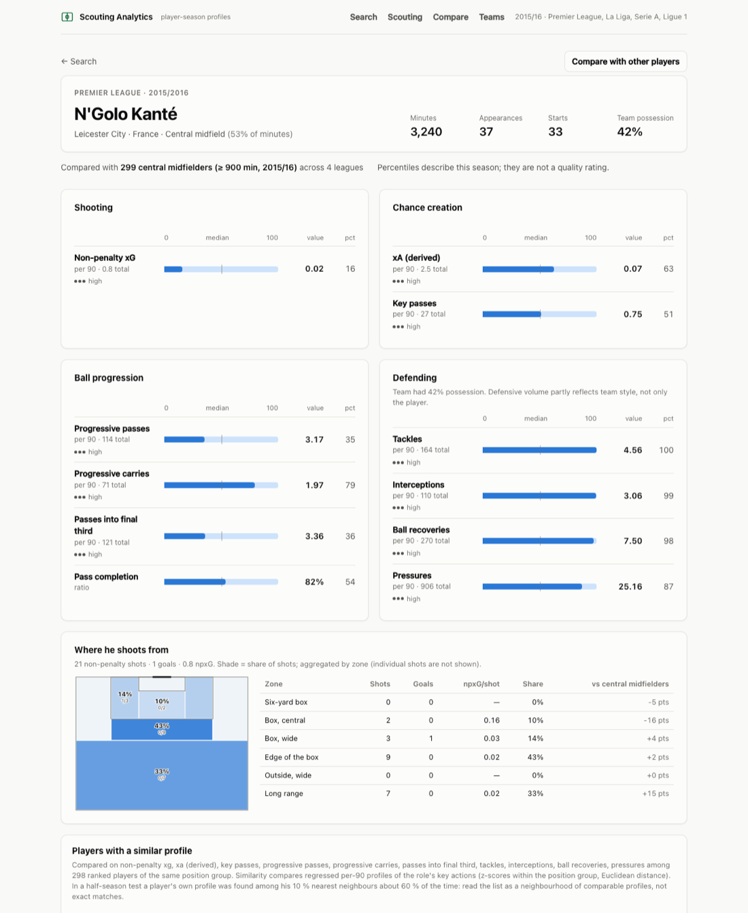
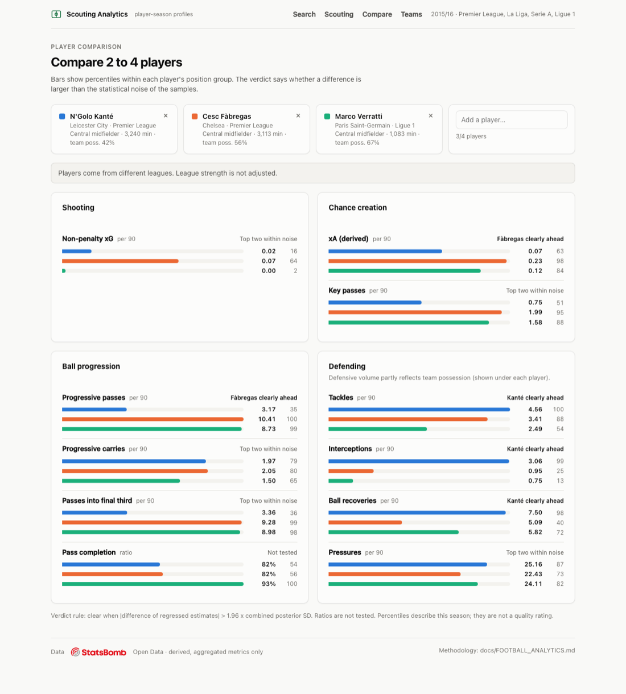
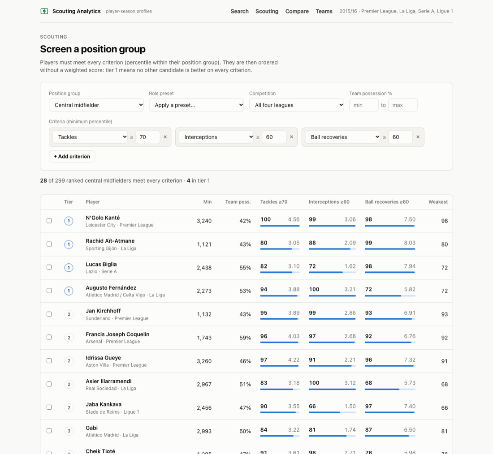
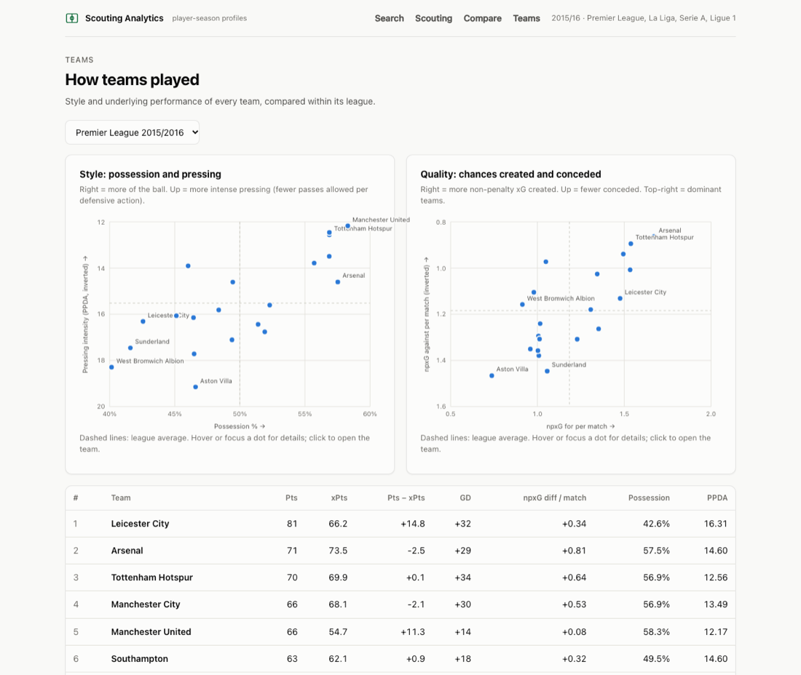

# Football Scouting Analytics

[](https://github.com/Saff-Buraq-Dev/football-scouting-analytics/actions/workflows/ci.yml)

A football analytics and scouting platform built on event data: player profiles, comparison, scouting, team analysis, similarity search and shot maps. Every metric has a written definition, and every method was **validated on the data before it was shipped**.

It currently covers the 2015/16 Premier League, La Liga, Serie A and Ligue 1: **1,517 matches, 5.3 million events, 2,214 player-seasons, 80 teams**.

## What makes it different

Most football dashboards show numbers. This project checks whether the numbers mean what they seem to mean, and changes the method when they don't.

| Question | What the data showed | What the platform does |
|---|---|---|
| Are goals a good way to judge a striker over one season? | Reliability of goals per 90 over a full season: **0.38**, against **0.74** for non-penalty xG | Shows a reliability level and a regressed estimate next to every value |
| Is a gap between two players real? | Differences flagged "clear" held in the next half-season **88–94 %** of the time; "within noise" ones only 56–67 % | Comparison says "clear difference" or "within noise", with the reason |
| Does the standard possession adjustment (PAdj) work? | It turned a −0.22 correlation into **+0.87**: massive over-correction | Rejected. Defensive numbers are shown raw, next to team possession |
| Can scouting avoid arbitrary weighted scores? | Shortlists are sound (players stay at the 70th–86th percentile) but hard thresholds are brittle | Pareto tiers instead of a score, plus a "near misses" list |
| Which similarity measure recognises a player? | Fingerprint test across half-seasons: Euclidean on regressed profiles **25× better than chance**; Mahalanobis worse | Similarity percentile ("closer than 97 % of the group"), never a made-up "% similar" |

Every decision is recorded in [docs/DECISIONS.md](docs/DECISIONS.md) (D001–D023), and every metric is defined in [docs/FOOTBALL_ANALYTICS.md](docs/FOOTBALL_ANALYTICS.md).

## Screenshots

<p><br>
<sub>All analysis below is derived from StatsBomb Open Data. Only aggregated, derived metrics are shown.</sub></p>

**Player profile.** Position-specific percentiles, reliability, team context, shot zones and similar players:



**Comparison.** Every metric says whether the difference is clear or within noise:



**Scouting.** Role presets, weight-free Pareto ranking:



**Teams.** Style map (possession × pressing), quality map, points against expected points:



## Architecture

The platform is **provider-agnostic**. StatsBomb is one adapter behind a canonical data model, and the analytics never import provider code (this is enforced by a test).

```text
StatsBomb open data ─► Provider adapter ─► Canonical model ─► Analytics ─► API ─► Web interface
     (raw JSON)         (mapping, quality      (PostgreSQL)     (pandas,     (FastAPI)  (React + TS)
                         rules, validation)                     tested)
```

| Layer | Technology |
|---|---|
| Ingestion and canonical model | Python 3.12, dataclasses, Parquet |
| Storage | PostgreSQL 17 (plain SQL migrations) |
| Analytics | pandas, NumPy: every rule has a test |
| API | FastAPI, read-only, aggregated data only |
| Interface | React, TypeScript, Vite; light and dark themes; accessible charts |
| Quality | about 290 tests; CI with a real PostgreSQL on every push |

More detail: [docs/ARCHITECTURE.md](docs/ARCHITECTURE.md).

## Run it locally

Requires Python 3.12, Node 22+ and Docker.

```bash
python3.12 -m venv .venv && .venv/bin/pip install -e ".[dev]"
cp .env.example .env && docker compose up -d                            # PostgreSQL on localhost:5433

.venv/bin/python -m football_platform.pipeline.ingest                   # download + validate (~5 min, ~4.3 GB)
.venv/bin/python -m football_platform.pipeline.load_database            # load PostgreSQL (~5 min)
.venv/bin/python -m football_platform.reports.player_season_report      # player analytics snapshot
.venv/bin/python -m football_platform.reports.team_season_report        # team analytics snapshot

.venv/bin/uvicorn football_platform.api.app:app --port 8000             # API (docs at /docs)
cd frontend && npm install && npm run dev                               # http://localhost:5173
```

Tests: `.venv/bin/pytest` (database tests run when PostgreSQL is reachable) and `cd frontend && npm test`.

## Data and licensing

- **No football data is stored in this repository.** The pipeline downloads StatsBomb Open Data, pinned to a specific commit.
- StatsBomb Open Data is used under the [StatsBomb Public Data User Agreement](https://github.com/hudl/open-data): non-commercial use, no redistribution of the data, StatsBomb logo on published analysis. The API serves derived, aggregated metrics only, never raw events.
- The code is released under the [MIT License](LICENSE). The license does not cover the data or the StatsBomb logo.

## Project documents

| Document | Content |
|---|---|
| [PROJECT.md](PROJECT.md) | objectives and scope |
| [ROADMAP.md](ROADMAP.md) | phases and status |
| [docs/DATA_PROVIDERS.md](docs/DATA_PROVIDERS.md) | evaluation of free and commercial data providers |
| [docs/data/](docs/data/) | coverage audit, data dictionary, StatsBomb mapping specification |
| [docs/FOOTBALL_ANALYTICS.md](docs/FOOTBALL_ANALYTICS.md) | metric definitions, methods, validation results |
| [docs/DECISIONS.md](docs/DECISIONS.md) | decision log |
